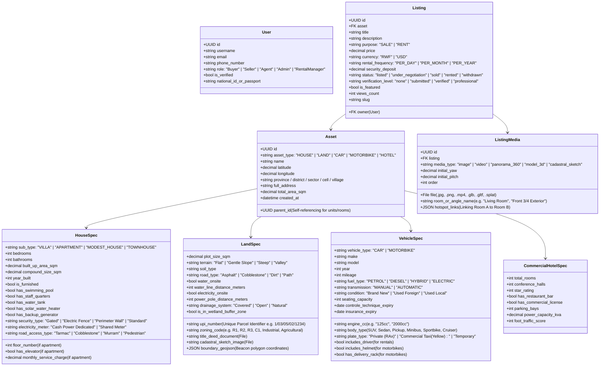
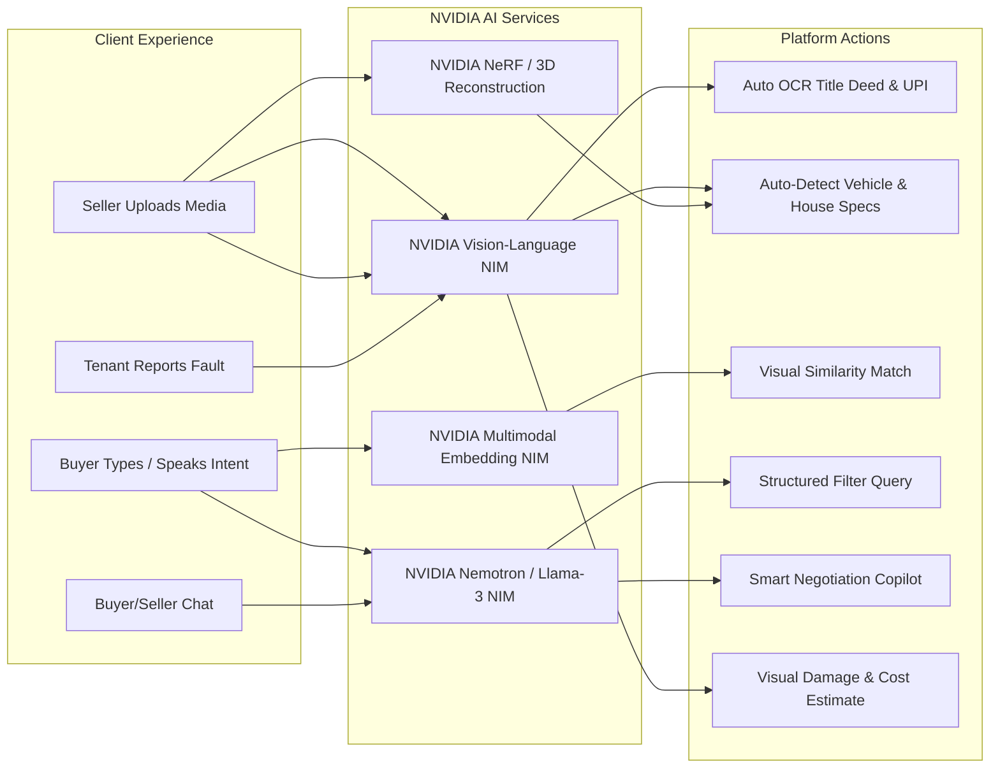

# Urugwiro Enterprise System Blueprint & Architectural Specification

## 1. Executive Vision & Architecture Philosophy

Urugwiro is a **Multi-Asset Discovery & Trust Operating System** built for high-trust digital transactions across Rwanda and global diaspora investors. It unifies four core asset categories:
1. **Houses & Living Spaces** (Villas, Apartments, Modest Homes, Commercial Buildings, Hotels/Guest Houses)
2. **Lands & Plots** (Residential, Commercial, Agricultural, Industrial with UPI Cadastral Intelligence)
3. **Cars** (Sale & Daily/Monthly Rental)
4. **Motorbikes** (Sale & Commercial/Private Rental)

### The Core Architectural Principle: Asset vs. Listing
- **The Asset (`Asset`)**: The immutable physical source of truth (the land parcel, the building, the vehicle). It retains historical ownership, geolocation, UPI, and physical specifications.
- **The Listing (`Listing`)**: The marketing offer layer. It defines transaction purpose (**SALE** vs. **RENT**), pricing, terms, media, and visibility.
- **The Specification (`Spec`)**: Polymorphic detail entities attached to the Asset (`HouseSpec`, `LandSpec`, `VehicleSpec`, `CommercialHotelSpec`).

---

## 2. Complete Data Model Specification

---

## 3. 3D Virtual Navigation Architecture

To deliver fluid 3D experiences in React with Three.js (`@react-three/fiber` & `@react-three/drei`):

### 3.1 Supported 3D Formats & Pipelines
1. **360° Equirectangular Panoramas**:
   - **Resolution**: 4096×2048 or 6000×3000 JPG/PNG.
   - **Capture Device**: Insta360, Ricoh Theta, or smartphone panorama.
   - **Interactive Viewer**: Three.js inverted sphere geometry with interactive raycasted pins linking adjacent rooms.
2. **GLTF / GLB 3D Models (Digital Twins)**:
   - **Resolution**: Compressed binary GLB files (< 25MB) using Draco mesh compression.
   - **Capture Device**: iPhone Pro LiDAR scans (Polycam), drone photogrammetry, or architectural CAD models.
   - **Viewer**: Interactive 3D OrbitControls with dollhouse cutaway and floor-plan switching.
3. **3D Gaussian Splatting / NeRF**:
   - **Resolution**: `.splat` point cloud files for photorealistic rendering of cars and luxury compounds.

---

## 4. Land UPI Cadastral & Spatial Intelligence

Every land asset in Rwanda is grounded in the official cadastral registry:
1. **UPI Verification Engine**: Real-time format validation of the 14-digit Rwandan UPI (`P/DD/SS/CC/NNNN`).
2. **Interactive Cadastral Viewer**:
   - Leaflet / Mapbox satellite view rendering the exact beacon polygon coordinates (`boundary_geojson`).
   - Comparison with adjacent plot UPI numbers.
3. **Master Plan 2050 Overlay**:
   - Displays permitted zoning (R1, R2, R3, Commercial, Industrial).
   - Shows infrastructure proximity (distance to nearest tarmac road, hospital, water mains, power grid).

---

## 5. End-to-End Business Operations

### 5.1 Payments & Escrow (`Transaction`, `EscrowDeposit`)
- **Supported Gateways**: MTN MoMo API, Airtel Money, Bank Transfer, Visa/Mastercard.
- **Transaction Types**:
  - `RENT_PAYMENT`: Recurring tenant payments with automated digital receipts.
  - `EARNEST_DEPOSIT`: Escrow deposit to lock a house/land deal during title transfer.
  - `VEHICLE_PURCHASE` / `VEHICLE_RENTAL_FEE`: Daily rental hold or full purchase payment.
  - `VERIFICATION_FEE`: Professional site inspection fee.
- **Escrow Safeguard**: Funds are locked in escrow and only released upon bilateral verification (buyer confirms inspection + admin verifies title/car transfer).

### 5.2 Contextual Real-Time Messaging (`Conversation`, `ChatMessage`)
- **Listing Context**: Every conversation thread is bound to a specific `Listing`, showing price, photos, and quick-action buttons at the top.
- **Deal Actions**: Integrated *"Make an Offer"*, *"Counter Offer"*, and *"Schedule Visit"* triggers inside the chat interface.
- **Live Communication**: Real-time delivery via Django Channels WebSockets.

### 5.3 Leases & Maintenance Lifecycle
- **Smart Digital Lease**: Auto-fills tenant name, owner name, UPI, rent amount, and payment schedule into an enforceable digital lease with cryptographic signature.
- **Maintenance Ticket Pipeline**:
  - Tenant submits issue with photo/video.
  - Status tracking: `SUBMITTED` $\rightarrow$ `DIAGNOSED` $\rightarrow$ `IN_REPAIR` $\rightarrow$ `RESOLVED`.
  - Automatic notification to assigned landlord/manager.

### 5.4 Smart Notifications & Live Updates
- **Multi-Channel Alerts**: In-app notifications + SMS/WhatsApp alerts for high-priority events (Offer Accepted, Rent Due, Visit Booked).
- **Public Updates & Market Index**: Real-time feed of market reports, regulatory updates, and neighborhood price trends.

---

## 6. Comprehensive NVIDIA AI Integration Plan

1. **Title Deed & UPI OCR Verification (NVIDIA Vision NIM)**:
   - Scans uploaded Rwandan title deeds (*Icyangombwa*), extracts UPI, owner identity, and plot area, and compares against listing inputs to prevent fraud.
2. **Automated Spec Detection & Luxury Narrative**:
   - Car photo upload $\rightarrow$ extracts Make, Model, Color, Condition, and suggests price.
   - House photo upload $\rightarrow$ drafts a high-conversion luxury marketing description.
3. **Visual Similarity & Natural Intent Search**:
   - Buyers can upload an image of their dream villa or car to find similar inventory.
   - Voice/Text Intent: Converts *"3 bedroom house in Kibagabaga with a pool under 120M RWF"* into exact database filters.
4. **Multilingual Negotiation Assistant**:
   - Translates messages between Kinyarwanda, English, and French in real time.
   - Generates counter-offer suggestions based on historical market comparables.
5. **Visual Maintenance Diagnostics**:
   - Analyzes photos of plumbing leaks, electrical faults, or vehicle wear to classify severity and estimate repair costs.

---

## 7. Migration Plan: Decommissioning Legacy Models

| Legacy Entity | Target Architecture Entity | Migration Action |
| :--- | :--- | :--- |
| `Property` | `Asset` + `HouseSpec` | Migrate data to `Asset` + `HouseSpec`; redirect views to `/api/listings/`. |
| `SaleProperty` | `Listing` + `Asset` | Convert to unified `Listing` (purpose='SALE'); retire table. |
| `Owner`, `Seller` | `UserProfile` (role='Seller'/'Owner') | Merge into unified `UserProfile`; assign permissions dynamically. |
| `Tenant` | `UserProfile` (role='Buyer'/'Tenant') | Merge profile fields into `UserProfile`; retain `Lease` relations. |
| `ListingMedia.file` | Change `ImageField` $\rightarrow$ `FileField` | Update field definition to allow 3D `.glb` and `.splat` uploads. |
| Hardcoded Template Views | React SPA Components + DRF APIs | Replace Django HTML views with client-side zero-reload pages. |
